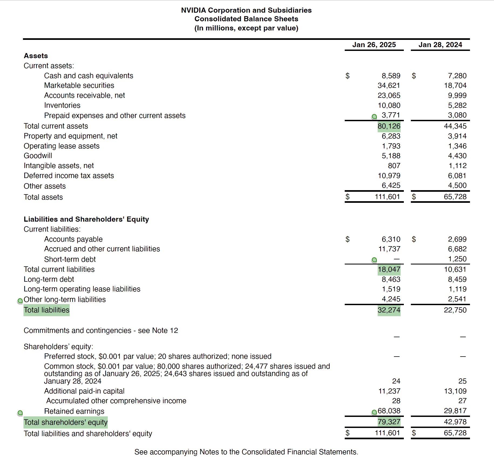

# Precise_RAG
## Aim:
1. Assess the performance of different RAG methods in financial documents analysis (primaryly for background investigation for consulting or stock purchase).
2. Build a webapp for easy interaction with the best performance RAG method.

## Assessment criteria:
1. relevance
2. length of retrieved context
3. <s>speed</s>
4. <s>cost</s>

## Methods to test:
1. Dense Embeddings
   1.1 parameters
   1.2 <s>finetune embedding model (need GPU machine, too expensive for now)</s>
2. ColBERT
4. Hybrid retriever and rerank
5. <s>Knowledge Augmented Generation (KAG, need to build a domain-specific architecture from sratch)</s>
6. <s>Contextual retrieval preprocessing (use llm to search through all chunks, too expensive)</s>

## Conclusion:
Hybrid search combined ColBert, BM25 and reranker had the best performance. ColBert had significantly better performance than dense embeddings. Keyword search did not contribute too much in hybrid search. But rerank put the most relevent content on top, especially in precise searched. Between two dense embedding models, the one with more parameters worked better and also large context will improve the performance. Due to the limitation of fund and time, I did not explore larger or fine tuned embedding models and those may outperform all the methods included in this study.

